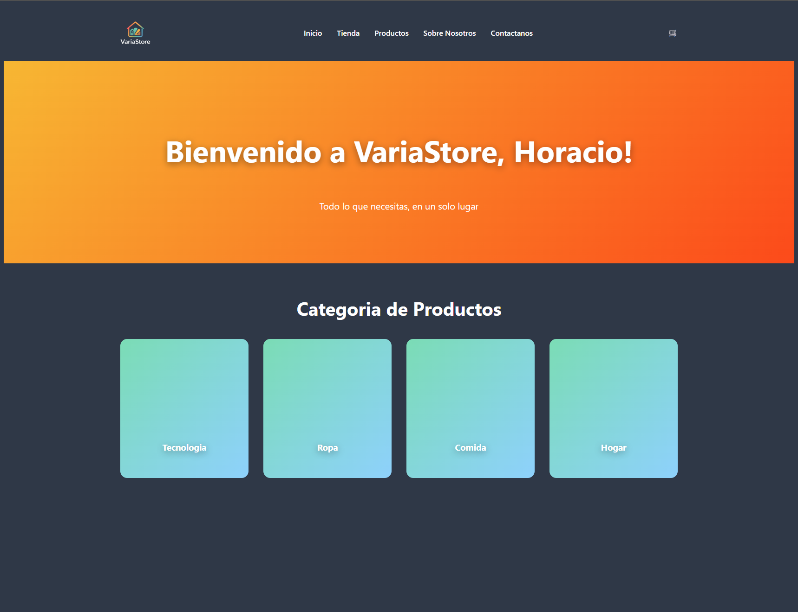
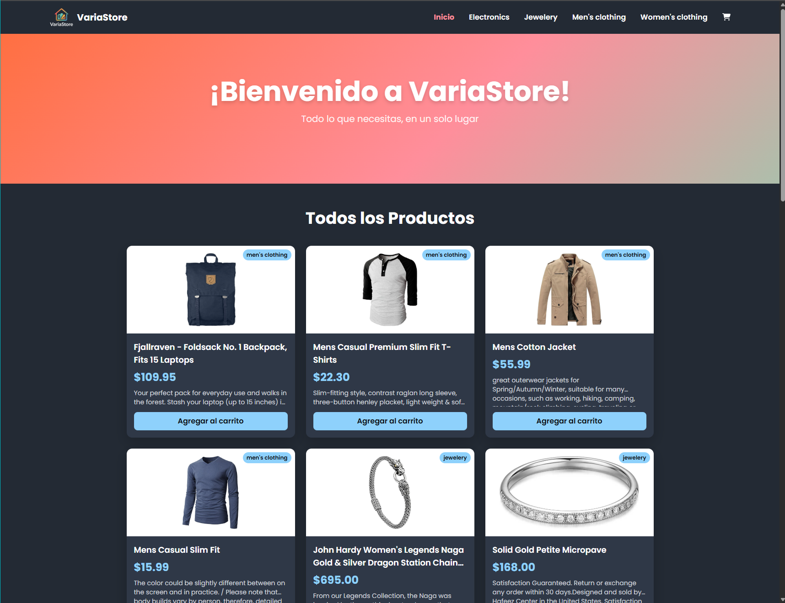
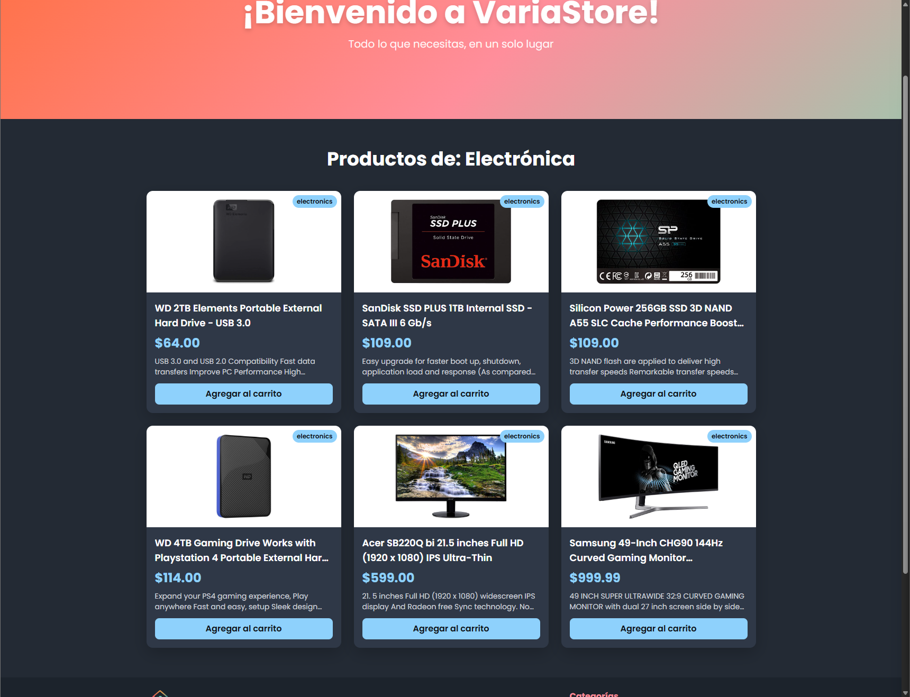
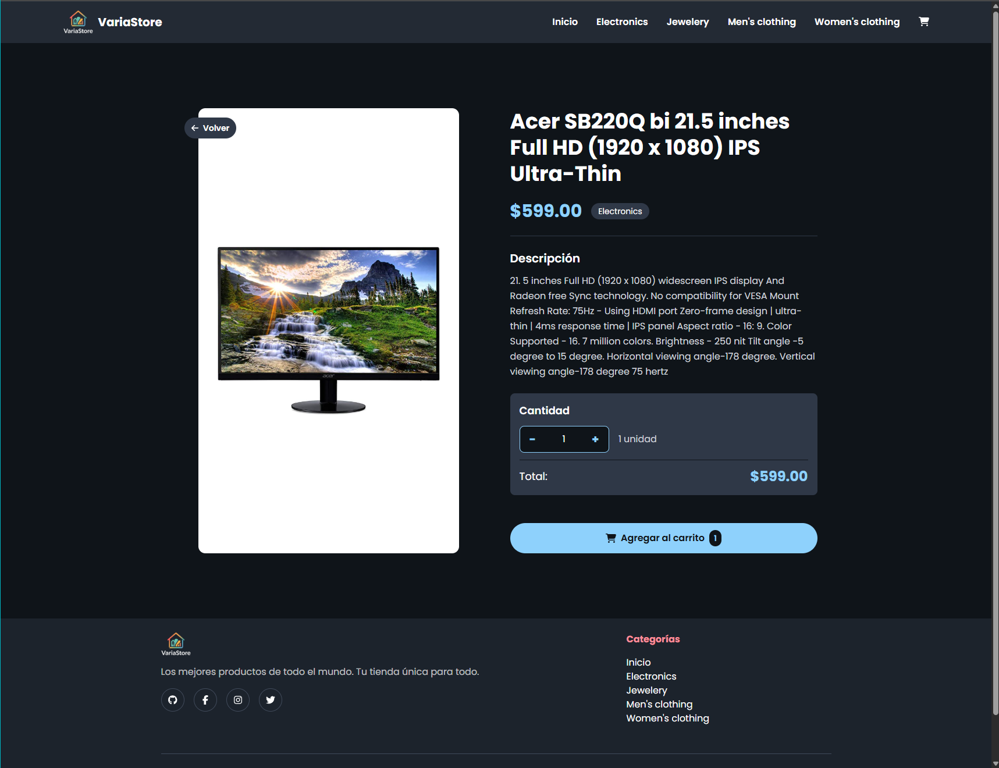
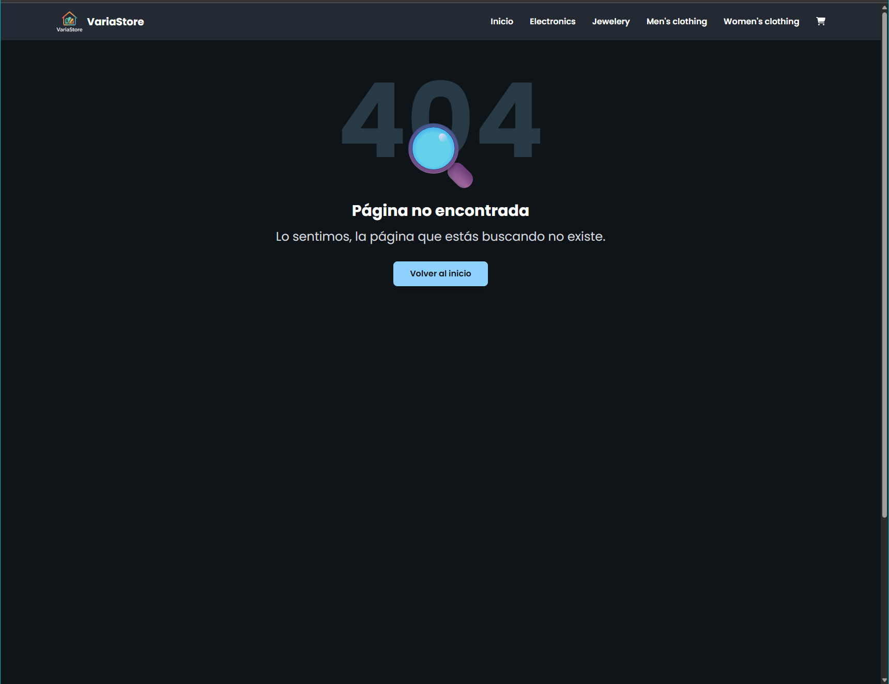

<h1></h1>
<h2>Coderhouse - Comision 88185</h2>
<h3>
  
  
  
  
  
  
  
</h3>
<h2>Entrega #1 (20-6-2025)</h2>
<h3>Objetivos</h3>
<ul>
  <li>Comprender los conceptos básicos de React y su estructura de componentes.</li>
  <li>Crear las bases para la homepage del ecommerce</li>
</ul>
<h3>Requisitos</h3>
<ul>
  <li>Archivos para los componentes NavBar, CartWidget, e ItemListContainer, dentro de la carpeta components.</li>
  <li>Organización correcta de los mismos: NavBar e ItemListContainer serán renderizados en App, mientras que CartWidget será renderizado en NavBar.</li>
  <li>Uso de props para enviar un string con un mensaje hacia el componente ItemListContainer.</li>
</ul>

<h2>Entrega #2 (11-7-2025)</h2>

Implementa una herramienta de routing, la cual permitirá navegar a través de las diferentes vistas para tu tienda: catálogo principal de productos, catálogo de productos filtrados por categorías, y vista en detalle de un producto. Crea la funcionalidad necesaria para que los usuarios puedan:

<ul>
  <li>Seleccionar desde el menú las distintas categorías disponibles.</li>
  <li>Visualizar el listado, filtrando según esa elección.</li>
  <li>Seleccionar un producto del listado y acceder a una vista en detalle del mismo, donde además contarán con una interfaz que posteriormente les permita agregar unidades al carrito.</li>
</ul>
<h3>Objetivos</h3>
<ul>
  <li>Implementar la funcionalidad de navegación entre las diferentes vistas utilizando enlaces y rutas.</li>
  <li>Desarrollar la navegabilidad básica de la aplicación, permitiendo navegar desde el catálogo al detalle de cada item.</li>
</ul>
<h3>Requisitos</h3>
<ul>
  <li>Implementación de React Router y creación de las distintas rutas necesarias para mostrar las vistas de nuestra app.</li>
  <li>División entre componentes contenedores encargados de manejar el estado y los efectos (ItemListContainer, ItemDetailContainer) y componentes de presentación, encargados del apartado visual (estructura de elementos, estilos, classNames, etc.)</li>
  <li>Los componentes contenedores harán un llamado asíncrono a "Promises" que resuelvan luego de un breve retardo los datos solicitados (listado de productos, un producto)</li>
  <li>Uso del método Array.map() y la prop "key" para listar todos los productos en el catálogo.</li>
  <li>Uso del hook useParams() de react router para leer el segmento actual de la URL y mostrar el contenido correspondiente.</li>
</ul>
<table>
  <tr>
    <td>
    <h3>Vista Principal</h3>
    
    </td>
    <td>
    <h3>Vista de Categoría (Electronica)</h3>
    
    </td>
  </tr>
  <tr>
    <td>
    <h3>Vista de Detalle del Producto</h3>
    
    </td>
    <td>
    <h3>Vista de la pagina Error 404</h3>
    
    </td>
  </tr>
</table>
