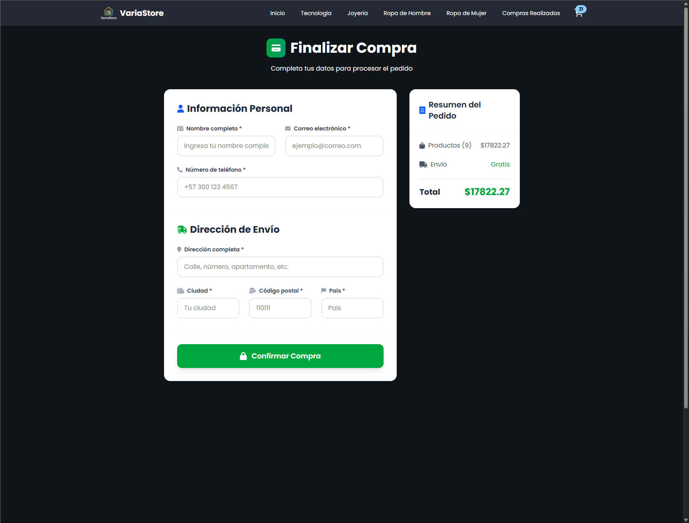

# 

## Coderhouse - Comision 88185

### Tecnologías utilizadas

## Link de Vercel

[https://coderhouse-react-88185.vercel.app/](https://coderhouse-react-88185.vercel.app/)

---

## Entrega #1 (20-6-2025)

### Objetivos

- Comprender los conceptos básicos de React y su estructura de componentes.
- Crear las bases para la homepage del ecommerce.

### Requisitos

- Archivos para los componentes `NavBar`, `CartWidget` e `ItemListContainer`, dentro de la carpeta `components`.
- Organización correcta:
  - `NavBar` e `ItemListContainer` serán renderizados en `App`.
  - `CartWidget` será renderizado en `NavBar`.
- Uso de props para enviar un string con un mensaje hacia el componente `ItemListContainer`.

---

## Entrega #2 (11-7-2025)

Implementa una herramienta de routing para permitir la navegación entre las distintas vistas del ecommerce.

### Funcionalidades

- Seleccionar categorías desde el menú.
- Visualizar listado de productos filtrado por categoría.
- Seleccionar un producto y acceder a su vista detallada con opción de agregarlo al carrito.

### Objetivos

- Implementar navegación con rutas.
- Permitir navegación desde el catálogo al detalle del producto.

### Requisitos

- Uso de React Router con rutas bien definidas.
- Separación entre componentes contenedores (estado/lógica) y de presentación (estructura/estilo).
- Componentes contenedores consumen datos simulados mediante Promises.
- Renderizado de productos con `Array.map()` y uso de `key`.
- Uso del hook `useParams()`.

| Vista Principal                      | Vista de Categoría (Electrónica)               |
| ------------------------------------ | ---------------------------------------------- |
|  |  |

| Vista Detalle del Producto                  | Página de Error 404                       |
| ------------------------------------------- | ----------------------------------------- |
|  |  |

---

## Entrega Final (3-8-2025)

Desarrolla una SPA de e-commerce con React, aplicando los conceptos fundamentales como componentes, hooks, routing, manejo de eventos, estado global y conexión a Firebase.

### Objetivos

- Desarrollar el front-end de un e-commerce en React.
- Integrar Firebase (Firestore) como base de datos.

### Requisitos

#### Listado y Detalle de Productos

- Listado dinámico de productos y vista en detalle (`ItemListContainer` y `ItemDetailContainer`).

| `ItemListContainer.jsx`                          | `ItemDetailContainer.jsx`                          |
| ------------------------------------------------ | -------------------------------------------------- |
|  |  |

- Separación entre contenedores y presentación (`ItemListContainer` - `ItemList`).
- `ItemCount` para seleccionar cantidad, con validaciones.

#### `ItemCount.jsx` - Stock no disponible

---

### Navegación

- Navegación entre catálogo, categorías, detalle, carrito y checkout con React Router.

| `NavBar.jsx`                             | `Footer.jsx`                             |
| ---------------------------------------- | ---------------------------------------- |
|  |  |

- Navegación tipo SPA (sin recargar la página).

---

### Criterio de Compras

- Estado del carrito mediante Context.
- Componente `Cart` muestra productos, cantidades, subtotales, etc.
- `CartWidget` con ícono e indicador de cantidad de productos.

#### `Cart.jsx` y `CartWidget.jsx`

---

### Firebase

- Uso de Firestore como base de datos.
- Colección de productos y consultas desde React.
- Generación de documento al confirmar compra.

| `Checkout.jsx`                               | `Confirmacion.jsx`                                   |
| -------------------------------------------- | ---------------------------------------------------- |
|  |  |

---

### Experiencia de Usuario

- Renderizado condicional para loaders y mensajes (“sin stock”, “carrito vacío”, etc.).

#### `Cart.jsx` - Carro vacío

- Mostrar ID de orden generada en Firestore.

| `ComprasList.jsx`                                  | `Compras.jsx`                              |
| -------------------------------------------------- | ------------------------------------------ |
|  |  |

---

### Buenas Prácticas y Convenciones

- Nombres consistentes en variables, funciones, componentes y eventos.
- Documentación del proyecto en formato Markdown.
